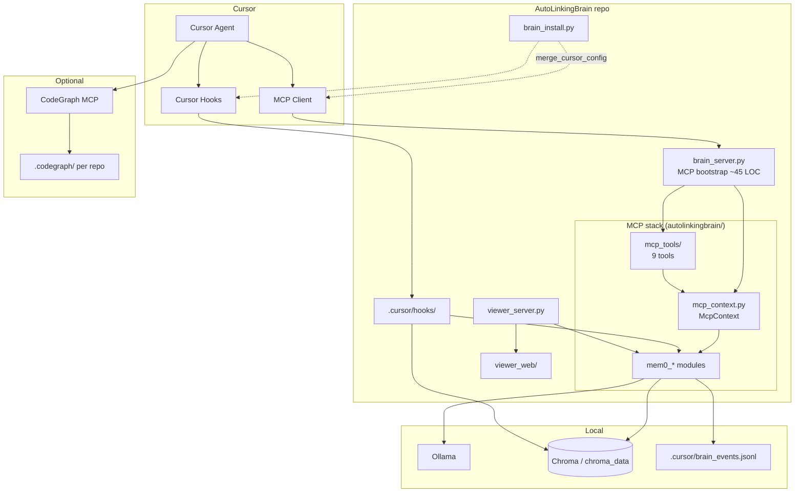
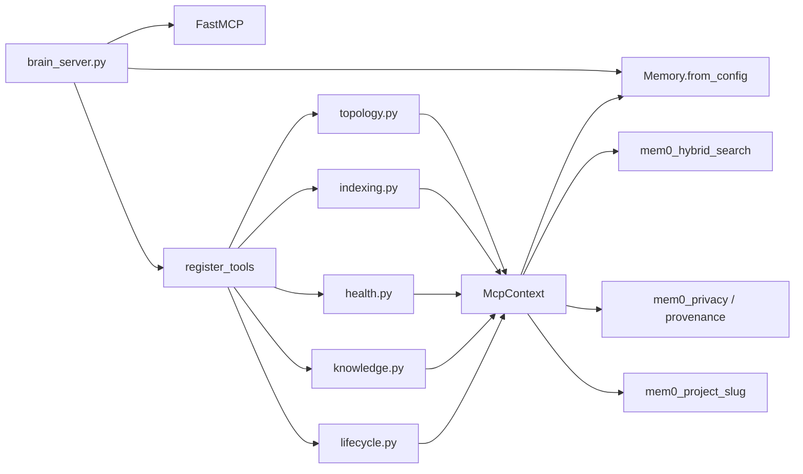

# Архитектура AutoLinkingBrain

## Обзор

**Ключевая идея:** `brain_server.py` — только bootstrap (path, logging, `Memory.from_config`, `FastMCP`). Вся логика инструментов — в `mcp_tools/` + shared runtime в `mcp_context.py`.

## Разделение ответственности

| Компонент | Запуск | Назначение |
|-----------|--------|------------|
| **MCP** (`brain_server.py` → `mcp_tools/`) | Cursor через `~/.cursor/mcp.json` | 9 инструментов памяти для агента |
| **Hooks** (`.cursor/hooks/*.py`) | Cursor через `~/.cursor/hooks.json` | Контекст сессии + автолог без MCP |
| **Viewer** (`brain.py start`) | Пользователь / `start.bat` | Brain Viewer: `viewer_server` + `viewer_web` (граф + Ops) |
| **Installer** (`brain.py install`, `scripts/install.ps1`) | Пользователь | venv, `.env`, merge MCP/hooks через `brain_install.merge_cursor_config` |
| **Legacy UI** (`viewer.py`) | Вручную, Streamlit | **Deprecated** — см. `requirements-legacy.txt` |
| **CodeGraph** | Отдельный MCP + CLI | Структура кода, не память |
| **CI** (`.github/workflows/ci.yml`) | GitHub Actions on push/PR | `pytest tests/` на Ubuntu, без Ollama/Chroma runtime |

**Важно:** `start.bat` не поднимает MCP. Cursor делает это сам при старте IDE.

## MCP: bootstrap и стек

### Порядок старта (`brain_server.py`)

1. Добавить корень репо в `sys.path`, включить `mcp_full_log` (stderr capture).
2. `MEM0_TELEMETRY=false` по умолчанию.
3. `Memory.from_config(mem0_vector_config())` — один экземпляр Chroma/Mem0 на процесс.
4. `FastMCP("AutoLinkingBrain", instructions=MCP_INSTRUCTIONS)`.
5. `McpContext(db=mem0_db)` — routing, search/add, health builders.
6. `register_tools(mcp, _mctx)` — регистрация всех `@mcp.tool`.

### MCP tools (9)

| Модуль | Tool | Назначение |
|--------|------|------------|
| `topology.py` | `registerDependency` | `[LINK]` зависимость между проектами → `global_topology` |
| `indexing.py` | `markIndexingComplete` | Маркер `FINAL_INDEXING_MARK` в `project_<slug>` |
| `health.py` | `checkProjectHealth` | Индексация, stale, suspicious slug, recall smoke |
| `health.py` | `sessionContextPack` | Компактный контекст для начала сессии |
| `knowledge.py` | `storeKnowledge` | Запись факта с privacy/provenance |
| `knowledge.py` | `retrieveChain` | Hybrid search (BM25 + vector RRF) по каналам |
| `lifecycle.py` | `listRecentMemories` | Недавние факты по каналу |
| `lifecycle.py` | `listStaleMemories` | Устаревшие факты (threshold из env) |
| `lifecycle.py` | `deleteMemory` | Удаление по id |

Shared helpers (`get_project_id`, `mem_search`, `mem_add`, `_is_indexing_mark_memory`, health builders) живут в **`mcp_context.py`**, не в `brain_server.py`.

## Каналы памяти (user_id)

| Канал | Содержимое |
|-------|------------|
| `project_<slug>` | Факты текущего репозитория (slug из MCP roots / workspace) |
| `global_skills` | Переносимые практики между проектами |
| `global_topology` | `[LINK]` зависимости между проектами, `[CROSS_REF_AUTO]` |

Slug резолвится в `autolinkingbrain/mem0_project_slug.py` (monorepo, git root, child repos).

## Пакет `autolinkingbrain/`

| Модуль | Роль |
|--------|------|
| `mem0_settings` | Chroma path, Ollama models, Mem0 config dict |
| `mem0_hybrid_search` | BM25 + vector RRF для `retrieveChain` |
| `mem0_privacy` / `mem0_provenance` | Редакция секретов, метаданные источника |
| `mem0_lifecycle` | Stale detection (viewer badges, `listStaleMemories`) |
| `mem0_kb_log` | Legacy KB log + dual-write в metrics |
| `mem0_fetch` | `fetch_all_memories()` — viewer + scripts (**lazy** import Chroma) |
| `mem0_channels` | `classify_scope()` — тип канала без тяжёлых deps (для тестов/viewer) |
| `mcp_constants` | `MCP_INSTRUCTIONS`, indexing tokens |
| `mcp_context` | `McpContext`: routing, mem_search/mem_add, health/recall |
| `mcp_tools/` | 5 модулей, 9 tools — см. таблицу выше |
| `brain_metrics` | `brain_events.jsonl`, aggregation, Ops API |
| `brain_link_store` | `memory_cross_links.json` CRUD |
| `cross_link_mem0_sync` | Sync JSON → Mem0 metadata + topology |
| `brain_install` | `merge_cursor_config()` — merge `~/.cursor/mcp.json` and hooks |
| `codegraph_init` | Batch `codegraph init -i` |
| `paths` | `REPO_ROOT` для путей к данным |
| `mcp_full_log` | MCP stderr/logging capture |

Точки входа (`brain.py`, `brain_server.py`, `viewer_server.py`) остаются в корне репозитория — так проще указать пути в Cursor config.

## Потоки данных

### Запись (write)

1. **MCP `storeKnowledge`** → privacy/provenance → Mem0 → invalidate hybrid cache → metrics
2. **Hook `afterAgentResponse`** → Ollama distill (optional) → Mem0 `infer=False`
3. **Hook `postToolUse`** → one-line tool facts → Mem0
4. **`registerDependency` / `markIndexingComplete`** → Mem0 `infer=False` (явные маркеры, не LLM-inference)

### Чтение (read)

1. **`retrieveChain`** → hybrid search per channel → truncate → MCP response (not logged to agent context from metrics)
2. **`sessionStart` hook** (`session_mem0_bootstrap.py`) → compact list → `additional_context`
3. **Viewer** → `mem0_fetch.fetch_all_memories` + cross_links JSON; UI in `viewer_web/`
4. **`checkProjectHealth`** → проверка indexing mark (только реальные маркеры, не autolog с упоминанием токена)

## Hooks (без MCP)

| Hook | Файл | Когда |
|------|------|-------|
| `sessionStart` | `session_mem0_bootstrap.py` | Старт сессии — compact recall |
| `afterAgentResponse` | `mem0_autolog_after_response.py` | После ответа агента — distill → Mem0 |
| `postToolUse` | `mem0_autolog_post_tool.py` | После tool call — one-liner |

Hooks и MCP используют одни и те же `mem0_*` модули и Chroma, но hooks **не** вызывают `brain_server.py`.

## Документация по слоям

| Слой | Файл |
|------|------|
| Корень | [README.md](../README.md) |
| Пакет | [autolinkingbrain/README.md](../autolinkingbrain/README.md) |
| Hooks | [.cursor/hooks/README.md](../.cursor/hooks/README.md) |
| Viewer UI | [viewer_web/README.md](../viewer_web/README.md) |
| Scripts | [scripts/README.md](../scripts/README.md) |
| Contributing | [docs/CONTRIBUTING.md](CONTRIBUTING.md) |

## Файлы состояния (local, в .gitignore)

| Файл | Назначение |
|------|------------|
| `chroma_data/` | Векторная база |
| `memory_cross_links.json` | Рёбра между фактами (viewer + sync) |
| `cross_link_topology_state.json` | Дедуп topology sync |
| `.cursor/brain_events.jsonl` | Ops metrics |
| `.cursor/mem0_*` | Hook debug, dedupe, last run |
| `.understand-anything/` | UA knowledge graph (локальный артефакт) |

## Companion: CodeGraph

- Brain = **память и контракты** между репо
- CodeGraph = **граф кода** (symbols, call graph)
- Routing для агента: CodeGraph first for structure, Brain for decisions/history
- Init: `python brain.py codegraph` или `codegraph init -i` per repo

## Расширение

- Новые MCP tools → новый файл в `autolinkingbrain/mcp_tools/` + `register()` + строка в `mcp_tools/__init__.py`
- Shared MCP logic (routing, search wrappers) → `mcp_context.py`
- Новая логика Mem0 без MCP → `autolinkingbrain/mem0_*.py`
- Новые hook events → `.cursor/hooks/` + update `brain_install._merge_hooks`
- Viewer UI → `viewer_web/` + endpoints in `viewer_server.py` (not legacy `viewer.py`)
- Viewer remote bind: set `VIEWER_AUTH_TOKEN` when `VIEWER_HOST=0.0.0.0`
- Тесты → `tests/`; CI прогоняет `pytest` без live Ollama (mock/lazy imports где нужно)
