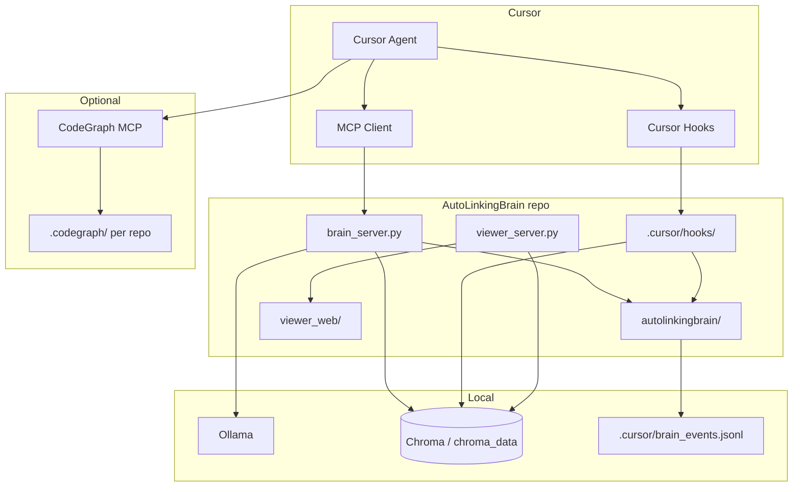

# Архитектура AutoLinkingBrain

## Обзор

## Разделение ответственности

| Компонент | Запуск | Назначение |
|-----------|--------|------------|
| **MCP** (`brain_server.py`) | Cursor через `~/.cursor/mcp.json` | Инструменты памяти для агента |
| **Hooks** (`.cursor/hooks/*.py`) | Cursor через `~/.cursor/hooks.json` | Контекст сессии + автолог без MCP |
| **Viewer** (`brain.py start`) | Пользователь / `start.bat` | Визуализация и Ops-метрики |
| **CodeGraph** | Отдельный MCP + CLI | Структура кода, не память |

**Важно:** `start.bat` не поднимает MCP. Cursor делает это сам при старте IDE.

## Каналы памяти (user_id)

| Канал | Содержимое |
|-------|------------|
| `project_<slug>` | Факты текущего репозитория (slug из MCP roots / workspace) |
| `global_skills` | Переносимые практики между проектами |
| `global_topology` | `[LINK]` зависимости между проектами, `[CROSS_REF_AUTO]` |

Slug резолвится в `autolinkingbrain/mem0_project_slug.py` (monorepo, git root, child repos).

## Пакет `autolinkingbrain/`

| Модуль | Роль |
|--------|------|
| `mem0_settings` | Chroma path, Ollama models, Mem0 config dict |
| `mem0_hybrid_search` | BM25 + vector RRF для `retrieveChain` |
| `mem0_privacy` / `mem0_provenance` | Редакция секретов, метаданные источника |
| `mem0_lifecycle` | Stale detection (viewer badges, `listStaleMemories`) |
| `mem0_kb_log` | Legacy KB log + dual-write в metrics |
| `mem0_fetch` | `fetch_all_memories()` — загрузка всех каналов (viewer + scripts) |
| `brain_metrics` | `brain_events.jsonl`, aggregation, Ops API |
| `brain_link_store` | `memory_cross_links.json` CRUD |
| `cross_link_mem0_sync` | Sync JSON → Mem0 metadata + topology |
| `brain_install` | Merge `mcp.json` / `hooks.json` |
| `codegraph_init` | Batch `codegraph init -i` |
| `paths` | `REPO_ROOT` для путей к данным |

Точки входа (`brain.py`, `brain_server.py`, `viewer_server.py`) остаются в корне репозитория — так проще указать пути в Cursor config.

## Потоки данных

### Запись (write)

1. **MCP `storeKnowledge`** → privacy/provenance → Mem0 → invalidate hybrid cache → metrics
2. **Hook `afterAgentResponse`** → Ollama distill (optional) → Mem0 `infer=False`
3. **Hook `postToolUse`** → one-line tool facts → Mem0

### Чтение (read)

1. **`retrieveChain`** → hybrid search per channel → truncate → MCP response (not logged to agent context from metrics)
2. **`sessionStart` hook** → `get_all` compact list → `additional_context`
3. **Viewer** → Chroma direct + cross_links JSON

## Файлы состояния (local, в .gitignore)

| Файл | Назначение |
|------|------------|
| `chroma_data/` | Векторная база |
| `memory_cross_links.json` | Рёбра между фактами (viewer + sync) |
| `cross_link_topology_state.json` | Дедуп topology sync |
| `.cursor/brain_events.jsonl` | Ops metrics |
| `.cursor/mem0_*` | Hook debug, dedupe, last run |

## Companion: CodeGraph

- Brain = **память и контракты** между репо
- CodeGraph = **граф кода** (symbols, call graph)
- Routing для агента: CodeGraph first for structure, Brain for decisions/history
- Init: `python brain.py codegraph` или `codegraph init -i` per repo

## Расширение

- Новые MCP tools → `brain_server.py`
- Новая логика Mem0 → `autolinkingbrain/`
- Новые hook events → `.cursor/hooks/` + update `brain_install._merge_hooks`
- Viewer UI → `viewer_web/` + endpoints in `viewer_server.py`
