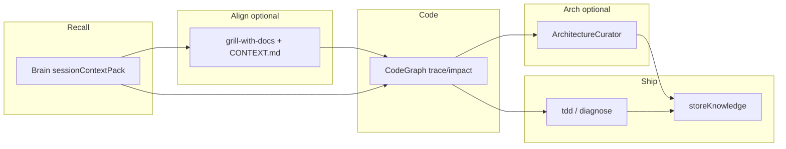

# Triumvirate: Brain + CodeGraph + Pocock discipline

Minimal composition of three strengths without turning AutoLinkingBrain into ECC.

## Why not bloated

| Layer | What you add | Token / complexity cost |
|-------|----------------|-------------------------|
| AutoLinkingBrain | Already have MCP + 2 rules + 1 skill | Baseline |
| CodeGraph | Optional binary + `.codegraph/` | Low per query |
| **Triumvirate** | 2 skills + `CONTEXT.md` + optional 4 Pocock skills | Low — agent-invoked |
| **ArchitectureCurator** | MCP profile `full` + skill `architecture-by-feature` | Per-feature doc writes |
| ECC (avoid) | 249 skills + hooks + instincts | High — overlaps Brain |

**Rule of thumb:** if a concern is already covered by Brain or CodeGraph, do not add a Pocock or ECC skill for it.

## Setup (this repo)

```bash
# Per machine: config/local/install.yaml with profile: full (gitignored)
python brain.py mcp install
python brain.py sync-agent --force-copy
```

Syncs **all** skills under `config/cursor/skills/` to `~/.cursor/skills/` (including `architecture-by-feature`).

Optional Matt Pocock skills:

```bash
./scripts/install-pocock-skills.sh
# Windows: .\scripts\install-pocock-skills.ps1
```

Then in Cursor chat (once per repo): run **`/setup-matt-pocock-skills`** if the installer added it.

## Try it (smoke test)

1. Open `mcp_server` in Cursor; reload window.
2. New agent task: *"Add a health-check line to sessionContextPack response when indexing is stale."*
3. Expect order: `sessionContextPack` → CodeGraph on `sessionContextPack` → implement → `storeKnowledge`.
4. Ambiguous variant: ask agent to use **mcp-triumvirate** and run **grill-with-docs** first; `CONTEXT.md` should gain any new terms.

## Division of labor



## Russian summary

**Триумвират** — порядок работы: память (Brain) → структура (CodeGraph) → по фичам документ (`ArchitectureCurator`, profile `full`) → дисциплина Pocock по желанию. ECC не нужен. Установка: `mcp install --profile full` + `sync-agent` + `CONTEXT.md`.
